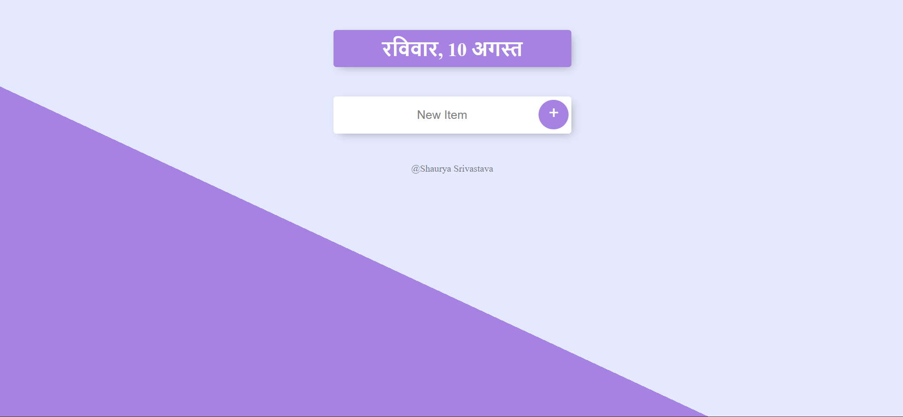

# ToDoList-V1

A simple To-Do application where tasks are stored in an in-memory JavaScript array. This is the first version, offering core functionality and a foundation for further enhancements.

##  Features

- Add tasks dynamically via the user interface
- View the current list of tasks
- Delete tasks as needed
- Timestamp each task when added
- Built using HTML, EJS, CSS, and JavaScript (Node.js + Express)

##  Tech Stack

- **Frontend**: HTML, CSS, [EJS](https://ejs.co/) templates
- **Backend**: Node.js with Express
- **Data Storage**: In-memory array (non-persistent)
- **Dependencies**: Listed in `package.json`

##  Installation & Running Locally

1. **Clone the repo**  
   ```bash
   git clone https://github.com/Thunderer9506/ToDoList-V1.git
   cd ToDoList-V1
   ```

2. **Install dependencies**  
   ```bash
   npm install
   ```

3. **Start the app**  
   ```bash
   node app.js
   ```

4. **Open in your browser**  
   Navigate to `http://localhost:3000` (or whichever port your app uses).

##  Usage

- Enter a task in the input field and hit "Add" (or press Enter).
- See the task appear in the list with a timestamp.
- Remove tasks using the provided delete button.

##  Project Structure

```
├── public/
│   └── css/          # Stylesheets
├── views/
│   ├── index.ejs     # Main page template
│   └── (other views) # If applicable
├── app.js            # Express app configuration & routes
├── date.js           # Module for managing timestamps
├── package.json      # Dependencies & metadata
├── package-lock.json # Exact versions installed
└── README.md         # (This file)
```

##  Future Enhancements

- Persistent storage (e.g., MongoDB)
- Task editing capability
- Complete “mark as completed” functionality
- User authentication system
- UI improvements and responsive design enhancements

##  Screenshot


